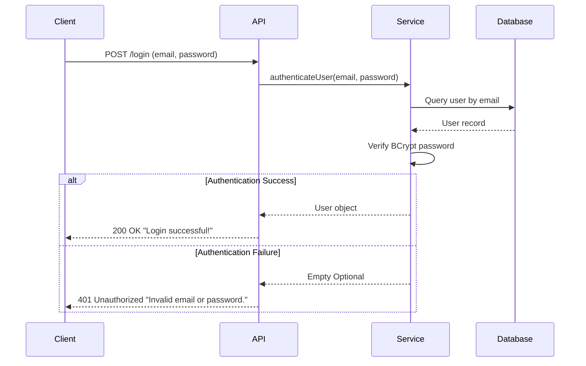

## Overview

The Med Agenda API provides role-based authentication for three distinct user types:

- **Patients** - End users scheduling and managing medical appointments
- **Doctors** - Medical professionals managing consultations and diagnoses
- **Administrators** - System administrators with elevated privileges

Each user type has its own authentication endpoint and credential validation system.

## How Authentication Works

The authentication system uses email and password credentials with the following security measures:

1. **Password Encryption**: All passwords are hashed using BCrypt algorithm before storage
2. **Credential Validation**: Email and password are verified against the database
3. **Response Handling**: Returns success message or 401 error for invalid credentials

<Note>
The current implementation uses basic authentication. For production environments, consider implementing JWT tokens or session-based authentication for enhanced security.
</Note>

## Authentication Flow



## Patient Authentication

### Login Endpoint

**Endpoint**: `POST /patients/login`

**Source**: `PatientController.java:24-31`

Authenticates a patient user and grants access to patient-specific functionality.

### Request

<ParamField body="email" type="string" required>
  Patient's registered email address
</ParamField>

<ParamField body="password" type="string" required>
  Patient's password (will be verified against BCrypt hash)
</ParamField>

### Example Request

```bash
curl -X POST http://localhost:8080/patients/login \
  -H "Content-Type: application/json" \
  -d '{
    "email": "joao.silva@example.com",
    "password": "securePassword123"
  }'
```

### Success Response

**Status Code**: `200 OK`

```json
"Login successful!"
```

### Error Response

**Status Code**: `401 Unauthorized`

```json
"Invalid email or password."
```

### Implementation Details

The patient authentication process:

1. Receives login request with email and password
2. Calls `PatientService.authenticatePatient(email, password)`
3. Service queries database for patient with matching email
4. Verifies password using BCrypt password encoder
5. Returns `Optional<Patient>` - present if credentials valid, empty otherwise

## Doctor Authentication

### Login Endpoint

**Endpoint**: `POST /doctor/login`

**Source**: `DoctorController.java:29-36`

Authenticates a doctor user and grants access to medical professional functionality.

### Request

<ParamField body="email" type="string" required>
  Doctor's registered email address
</ParamField>

<ParamField body="password" type="string" required>
  Doctor's password (will be verified against BCrypt hash)
</ParamField>

### Example Request

```bash
curl -X POST http://localhost:8080/doctor/login \
  -H "Content-Type: application/json" \
  -d '{
    "email": "dra.maria@hospital.com",
    "password": "doctorSecure456"
  }'
```

### Success Response

**Status Code**: `200 OK`

```json
"Login successful!"
```

### Error Response

**Status Code**: `401 Unauthorized`

```json
"Invalid email or password."
```

### Implementation Details

The doctor authentication process:

1. Receives login request with email and password
2. Calls `DoctorService.authenticateDoctor(email, password)`
3. Service queries database for doctor with matching email
4. Verifies password using BCrypt password encoder
5. Returns `Optional<Doctor>` - present if credentials valid, empty otherwise

## Administrator Authentication

### Login Endpoint

**Endpoint**: `POST /admin/login`

**Source**: `AdminController.java:23-30`

Authenticates an administrator user and grants access to system administration functionality.

### Request

<ParamField body="email" type="string" required>
  Administrator's registered email address
</ParamField>

<ParamField body="password" type="string" required>
  Administrator's password (will be verified against BCrypt hash)
</ParamField>

### Example Request

```bash
curl -X POST http://localhost:8080/admin/login \
  -H "Content-Type: application/json" \
  -d '{
    "email": "admin@medagenda.com",
    "password": "adminSecure789"
  }'
```

### Success Response

**Status Code**: `200 OK`

```json
"Login successful!"
```

### Error Response

**Status Code**: `401 Unauthorized`

```json
"Invalid email or password."
```

### Implementation Details

The admin authentication process:

1. Receives login request with email and password
2. Calls `AdminService.authenticateAdmin(email, password)`
3. Service queries database for admin with matching email
4. Verifies password using BCrypt password encoder
5. Returns `Optional<Admin>` - present if credentials valid, empty otherwise

## Session Management

The current implementation does not include session management or token generation. Each request is stateless.

### Recommended Enhancements

For production deployments, consider implementing:

1. **JWT Tokens**: Issue JSON Web Tokens upon successful authentication
2. **Session Storage**: Store active sessions with expiration times
3. **Refresh Tokens**: Implement token refresh mechanism for long-lived sessions
4. **Role-Based Access Control**: Enforce permissions based on user roles

### Example JWT Implementation (Recommended)

```json
{
  "token": "eyJhbGciOiJIUzI1NiIsInR5cCI6IkpXVCJ9...",
  "type": "Bearer",
  "expiresIn": 3600,
  "user": {
    "id": "uuid-here",
    "email": "user@example.com",
    "role": "PATIENT"
  }
}
```

## Security Considerations

### Password Security

All passwords are encrypted using BCrypt hashing algorithm configured in `SecurityConfig.java:27-29`:

```java
@Bean
public PasswordEncoder passwordEncoder() {
    return new BCryptPasswordEncoder();
}
```

**Key Features**:
- One-way hashing (passwords cannot be decrypted)
- Salt generation for each password
- Adaptive hashing (computational cost increases over time)

### HTTPS Requirement

<Warning>
Always use HTTPS in production to encrypt credentials during transmission. The current configuration allows HTTP for local development only.
</Warning>

### CORS Configuration

Cross-Origin Resource Sharing is configured in `WebConfig.java:12-18` to allow requests from:

- `http://localhost:5173` (development frontend)
- `https://final-project-poo2.vercel.app` (production frontend)

Allowed methods: `GET`, `POST`, `PUT`, `DELETE`, `OPTIONS`

### CSRF Protection

CSRF protection is disabled (`SecurityConfig.java:16`) to support stateless API requests. This is acceptable for token-based authentication but should be reconsidered if implementing session-based authentication.

## Error Handling

### Common Authentication Errors

| Error | Status Code | Description |
|-------|-------------|-------------|
| Invalid credentials | `401 Unauthorized` | Email or password is incorrect |
| Missing fields | `400 Bad Request` | Email or password not provided |
| Account not found | `401 Unauthorized` | No user exists with provided email |
| Server error | `500 Internal Server Error` | Database or service error |

### Debugging Authentication Issues

1. **Verify email format**: Ensure email is correctly formatted
2. **Check password**: Passwords are case-sensitive
3. **Confirm user exists**: Verify user was created successfully
4. **Database connectivity**: Ensure database connection is active
5. **BCrypt configuration**: Verify password encoder bean is properly configured

## Testing Authentication

### Using cURL

Test patient authentication:

```bash
# Successful login
curl -v -X POST http://localhost:8080/patients/login \
  -H "Content-Type: application/json" \
  -d '{"email":"test@example.com","password":"testpass123"}'

# Expected: 200 OK with "Login successful!"
```

```bash
# Failed login
curl -v -X POST http://localhost:8080/patients/login \
  -H "Content-Type: application/json" \
  -d '{"email":"test@example.com","password":"wrongpassword"}'

# Expected: 401 Unauthorized with "Invalid email or password."
```

### Using JavaScript/Fetch

```javascript
const login = async (email, password) => {
  try {
    const response = await fetch('http://localhost:8080/patients/login', {
      method: 'POST',
      headers: {
        'Content-Type': 'application/json',
      },
      body: JSON.stringify({ email, password }),
    });

    if (response.ok) {
      const message = await response.text();
      console.log(message); // "Login successful!"
      return true;
    } else {
      const error = await response.text();
      console.error(error); // "Invalid email or password."
      return false;
    }
  } catch (error) {
    console.error('Network error:', error);
    return false;
  }
};
```

## Next Steps

After successful authentication, explore these related API endpoints:

<CardGroup cols={2}>
  <Card title="Patient Management" icon="user" href="/api/patient">
    Create and manage patient accounts
  </Card>
  <Card title="Doctor Management" icon="user-doctor" href="/api/doctor">
    Create and manage doctor profiles
  </Card>
  <Card title="Admin Management" icon="user-shield" href="/api/admin">
    Manage administrator accounts
  </Card>
  <Card title="Consultations" icon="calendar" href="/api/consultations">
    Schedule and manage medical appointments
  </Card>
</CardGroup>