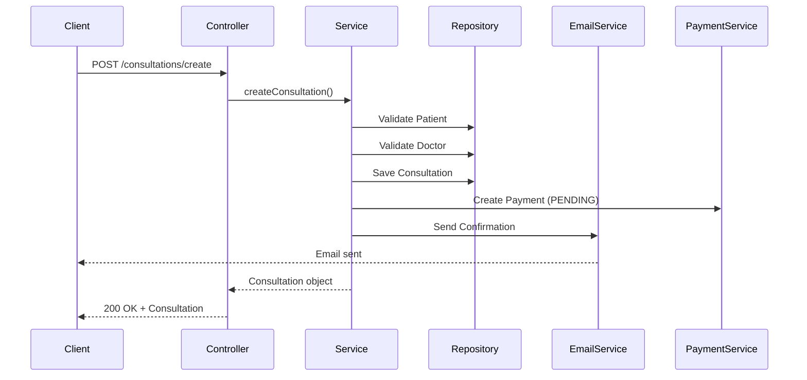

## Overview

Med Agenda's appointment scheduling system handles the complete lifecycle of medical consultations, including conflict detection, urgent consultation flagging, and automated email notifications. The system is built using Spring Boot and integrates with payment processing and diagnosis tracking.

## Appointment Data Model

Every consultation in Med Agenda contains the following information:

```java Patient.java:11-36
package com.ufu.gestaoConsultasMedicas.models;

@Entity
@Table(name = "consultation")
public class Consultation {
    @Id
    @GeneratedValue(strategy = GenerationType.UUID)
    private UUID consultationId;

    @Column(name = "date_time", nullable = false)
    private LocalDateTime dateTime;

    @Column(name = "duracao_minutos", nullable = false)
    private int duracaoMinutos = 60;

    @ManyToOne
    @JoinColumn(name = "patient_id", referencedColumnName = "cpf", nullable = false)
    private Patient patient;

    @ManyToOne
    @JoinColumn(name = "doctor_id", referencedColumnName = "crm", nullable = false)
    private Doctor doctor;

    @Column(name = "is_urgent", nullable = false)
    private boolean isUrgent;

    @Column(name = "observation")
    private String observation;
}
```

**Key Fields:**
- `consultationId`: Unique UUID identifier
- `dateTime`: Scheduled date and time for the consultation
- `duracaoMinutos`: Duration in minutes (default: 60 minutes)
- `patient`: Patient reference (linked by CPF)
- `doctor`: Doctor reference (linked by CRM)
- `isUrgent`: Flag for urgent consultations
- `observation`: Additional notes or comments

## Creating Appointments

The appointment creation process validates both patient and doctor, creates the consultation, generates a payment record, and sends email confirmation.

```java ConsultationService.java:42-76
public Consultation createConsultation(Patient patient, Doctor doctor, 
                                       LocalDateTime dateTime, boolean isUrgent, 
                                       String observation) {
    // Validate patient exists
    Patient patientFromDb = patientRepository.findByCpf(patient.getCpf())
            .orElseThrow(() -> new IllegalArgumentException(
                "Paciente com CPF " + patient.getCpf() + " não encontrado."));

    // Validate doctor exists
    Doctor doctorFromDb = doctorRepository.findByCrm(doctor.getCrm())
            .orElseThrow(() -> new IllegalArgumentException(
                "Médico com CRM " + doctor.getCrm() + " não encontrado."));

    // Create consultation
    Consultation consultation = new Consultation();
    consultation.setConsultationId(UUID.randomUUID());
    consultation.setDateTime(dateTime);
    consultation.setDuracaoMinutos(60);
    consultation.setPatient(patientFromDb);
    consultation.setDoctor(doctorFromDb);
    consultation.setUrgent(isUrgent);
    consultation.setObservation(observation);

    consultation = consultationRepository.save(consultation);

    // Create linked payment
    Payment payment = new Payment();
    payment.setConsultation(consultation);
    payment.setAmount(doctorFromDb.getConsultationValue());
    payment.setStatus(PaymentStatus.PENDING);
    paymentRepository.save(payment);

    // Send email confirmation
    emailService.sendEmail(
            "delivered@resend.dev",
            "Consulta confirmada",
            "Sua consulta foi marcada para " + consultation.getDateTime()
    );

    return consultation;
}
```

### API Endpoint

```java ConsultationController.java:25-36
@PostMapping("/create")
public ResponseEntity<Consultation> scheduleConsultation(
        @RequestBody Consultation consultation) {
    Consultation createdConsultation = consultationService.createConsultation(
            consultation.getPatient(),
            consultation.getDoctor(),
            consultation.getDateTime(),
            consultation.isUrgent(),
            consultation.getObservation()
    );
    return ResponseEntity.ok(createdConsultation);
}
```

**Endpoint:** `POST /consultations/create`

## Urgent Consultation Flagging

Med Agenda uses the Decorator pattern to mark consultations as urgent, allowing special handling and prioritization.

```java UrgentConsultationDecorator.java:10-24
public class UrgentConsultationDecorator implements ConsultationService {

    private final ConsultationService decoratedService;

    public UrgentConsultationDecorator(ConsultationService decoratedService) {
        this.decoratedService = decoratedService;
    }

    @Override
    public Consultation createConsultation(Patient patient, Doctor doctor, 
                                          LocalDateTime dateTime, String observation) {
        Consultation consultation = decoratedService.createConsultation(
            patient, doctor, dateTime, observation);
        consultation.setUrgent(true);
        return consultation;
    }
}
```

Urgent consultations are automatically flagged with `isUrgent = true` and can receive special treatment in scheduling and notifications.

## Updating Appointments

Appointments can be rescheduled by updating the date/time and observations.

```java ConsultationService.java:78-84
public Optional<Consultation> updateConsultation(UUID consultationId, 
                                                 LocalDateTime dateTime, 
                                                 String observation) {
    return consultationRepository.findById(consultationId).map(consultation -> {
        consultation.setDateTime(dateTime);
        consultation.setObservation(observation);
        return consultationRepository.save(consultation);
    });
}
```

**Endpoint:** `PUT /consultations/update`

## Canceling Appointments

Cancellation removes the appointment and all associated records (diagnosis, payment).

```java ConsultationService.java:86-102
public boolean cancelConsultation(UUID consultationId) {
    if (consultationRepository.existsById(consultationId)) {
        // Remove diagnosis if exists
        Optional<Diagnosis> diagnosis = diagnosisRepository
            .findByConsulta_ConsultationId(consultationId);
        if (diagnosis.isPresent()) {
            diagnosisRepository.delete(diagnosis.get());
        }
        
        // Remove payment if exists
        Optional<Payment> payment = paymentRepository
            .findByConsultation_ConsultationId(consultationId);
        if (payment.isPresent()) {
            paymentRepository.delete(payment.get());
        }
        
        consultationRepository.deleteById(consultationId);
        return true;
    }
    return false;
}
```

**Endpoint:** `DELETE /consultations/{id}`

## Querying Appointments

### Get Single Appointment

```java ConsultationService.java:104-106
public Optional<Consultation> getConsultationById(UUID consultationId) {
    return consultationRepository.findById(consultationId);
}
```

**Endpoint:** `GET /consultations/{id}`

### Get All Appointments

```java ConsultationService.java:108-110
public List<Consultation> getAllConsultations() {
    return consultationRepository.findAll();
}
```

**Endpoint:** `GET /consultations/all`

### Get Patient History

```java ConsultationService.java:112-114
public List<Consultation> getPatientConsultationHistory(String patientCpf) {
    return consultationRepository.findByPatient_Cpf(patientCpf);
}
```

**Endpoint:** `GET /consultations/patient-history/{cpf}`

## Conflict Detection

The repository provides methods to query consultations by date range, enabling conflict detection:

```java ConsultationRepository.java:20-34
@Query("""
  SELECT c
  FROM Consultation c
  WHERE c.dateTime BETWEEN :startOfDay AND :endOfDay
""")
List<Consultation> findByDateTimeBetween(
        @Param("startOfDay") LocalDateTime startOfDay,
        @Param("endOfDay")   LocalDateTime endOfDay
);

default List<Consultation> findByDate(LocalDate date) {
    LocalDateTime start = date.atStartOfDay();
    LocalDateTime end   = date.plusDays(1).atStartOfDay().minusNanos(1);
    return findByDateTimeBetween(start, end);
}
```

This allows checking for scheduling conflicts by querying all consultations within a specific time window.

## Appointment Lifecycle



## Integration with Other Systems

The appointment system integrates with:

1. **Payment System**: Automatic payment record creation with `PENDING` status
2. **Email System**: Confirmation emails via Resend API
3. **Diagnosis System**: Linked medical records and diagnoses
4. **Patient Records**: Complete consultation history tracking

## Best Practices

- Always validate patient and doctor existence before creating consultations
- Use UUID for consultation identifiers to ensure uniqueness
- Set default duration to 60 minutes unless specified otherwise
- Handle urgent consultations with the decorator pattern for flexibility
- Clean up all related records (payments, diagnoses) when canceling appointments
- Query by date range to detect scheduling conflicts before confirming
