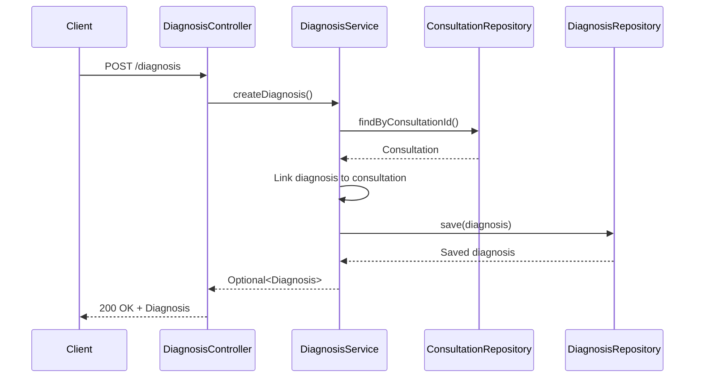
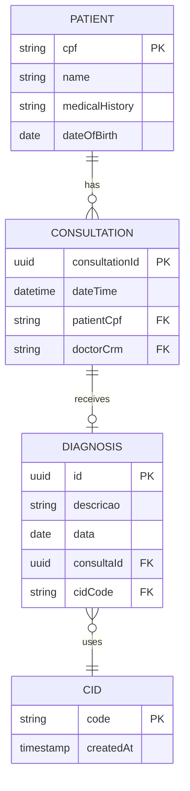

## Overview

Med Agenda's diagnosis system links medical diagnoses to consultations, integrates with CID (International Classification of Diseases) codes, and maintains comprehensive patient medical histories. Each diagnosis is connected to a specific consultation and includes standardized disease classification.

## Diagnosis Data Model

The diagnosis entity stores medical findings and classifications:

```java Diagnosis.java:8-38
@Entity
@Table(name = "diagnosis")
public class Diagnosis {

    @Id
    @GeneratedValue(strategy = GenerationType.UUID)
    private UUID id;

    @Column(nullable = false)
    private String descricao;

    @Column(nullable = false)
    private LocalDate data;

    @ManyToOne
    @JoinColumn(name = "consulta_id", nullable = false)
    private Consultation consulta;

    @JoinColumn(name = "cid_id", nullable = false)
    private String cid;

    public Diagnosis(UUID id, String descricao, LocalDate data, 
                     Consultation consulta, String cid) {
        this.id = id;
        this.descricao = descricao;
        this.data = data;
        this.consulta = consulta;
        this.cid = cid;
    }
}
```

**Key Fields:**
- `id`: Unique UUID identifier
- `descricao`: Detailed description of the diagnosis
- `data`: Date the diagnosis was made
- `consulta`: Reference to the associated consultation
- `cid`: CID code for disease classification

## CID Integration

Med Agenda uses the International Classification of Diseases (CID) standard:

```java Cid.java:8-31
@Entity
@Table(name = "cid")
public class Cid {

    @Id
    @Column(name = "code", length = 5, nullable = false, unique = true)
    private String code; // Examples: A00, A15.3

    @CreationTimestamp
    @Column(name = "created_at", updatable = false)
    private Instant createdAt;

    public Cid() {}

    public Cid(String code) {
        this.code = code;
    }

    public String getCode() { return code; }
    public void setCode(String code) { this.code = code; }

    public Instant getCreatedAt() { return createdAt; }
    public void setCreatedAt(Instant createdAt) { this.createdAt = createdAt; }
}
```

**CID Code Format:**
- Maximum 5 characters
- Examples: `A00` (Cholera), `A15.3` (Tuberculosis of lungs), `E11` (Type 2 diabetes)
- Follows international medical classification standards
- Automatically timestamped on creation

## Creating a Diagnosis

Diagnoses are created and linked to existing consultations:

```java DiagnosisService.java:22-32
public Optional<Diagnosis> createDiagnosis(Diagnosis diagnosis) {
    UUID consultaId = diagnosis.getConsulta().getConsultationId();
    Optional<Consultation> consulta = consultationRepository.findByConsultationId(consultaId);

    if (consulta.isPresent()) {
        diagnosis.setConsulta(consulta.get());
        return Optional.of(diagnosisRepository.save(diagnosis));
    }

    return Optional.empty();
}
```

### API Endpoint

```java DiagnosisController.java:19-28
@PostMapping
public ResponseEntity<?> createDiagnosis(@RequestBody Diagnosis diagnosis) {
    Optional<Diagnosis> created = diagnosisService.createDiagnosis(diagnosis);

    if (created.isPresent()) {
        return ResponseEntity.ok(created.get());
    } else {
        return ResponseEntity.badRequest().body("Consulta inválida.");
    }
}
```

**Endpoint:** `POST /diagnosis`

**Request Body:**
```json
{
  "descricao": "Patient presents with type 2 diabetes mellitus. Recommended lifestyle changes and metformin treatment.",
  "data": "2024-03-15",
  "consulta": {
    "consultationId": "550e8400-e29b-41d4-a716-446655440000"
  },
  "cid": "E11"
}
```

**Response:**
```json
{
  "id": "f47ac10b-58cc-4372-a567-0e02b2c3d479",
  "descricao": "Patient presents with type 2 diabetes mellitus. Recommended lifestyle changes and metformin treatment.",
  "data": "2024-03-15",
  "consulta": {
    "consultationId": "550e8400-e29b-41d4-a716-446655440000",
    "dateTime": "2024-03-15T10:00:00",
    "patient": { ... },
    "doctor": { ... }
  },
  "cid": "E11"
}
```

## Retrieving Diagnosis by Consultation

Get the diagnosis associated with a specific consultation:

```java DiagnosisService.java:34-36
public Optional<Diagnosis> findByConsultationId(UUID consultationId) {
    return diagnosisRepository.findByConsulta_ConsultationId(consultationId);
}
```

### API Endpoint

```java DiagnosisController.java:30-35
@GetMapping("/consultation/{id}")
public ResponseEntity<?> getDiagnosisByConsultationId(@PathVariable UUID id) {
    return diagnosisService.findByConsultationId(id)
            .map(ResponseEntity::ok)
            .orElseGet(() -> ResponseEntity.noContent().build());
}
```

**Endpoint:** `GET /diagnosis/consultation/{consultationId}`

## Patient Medical History

Patient medical history is tracked through:

1. **Medical History Field**: Free-text field on the patient entity
```java Patient.java:31-32
@Column(name = "medical_history")
private String medicalHistory;
```

2. **Consultation History**: All past consultations with linked diagnoses
```java Patient.java:34-36
@OneToMany(mappedBy = "patient", cascade = CascadeType.ALL, fetch = FetchType.LAZY)
@JsonIgnore
private List<Consultation> historicoConsultas;
```

3. **Diagnosis Records**: All diagnoses linked through consultations

## Complete Medical History Flow



## Diagnosis-Consultation Relationship

Each diagnosis is directly tied to one consultation:

```java
@ManyToOne
@JoinColumn(name = "consulta_id", nullable = false)
private Consultation consulta;
```

This ensures:
- Every diagnosis has context (date, doctor, patient)
- Medical findings are traceable to specific visits
- Historical records maintain referential integrity
- Cascading deletes preserve data consistency

## Cascade Deletion

When a consultation is canceled, associated diagnoses are automatically deleted:

```java ConsultationService.java:86-92
public boolean cancelConsultation(UUID consultationId) {
    if (consultationRepository.existsById(consultationId)) {
        Optional<Diagnosis> diagnosis = diagnosisRepository
            .findByConsulta_ConsultationId(consultationId);
        if (diagnosis.isPresent()) {
            diagnosisRepository.delete(diagnosis.get());
        }
        // ... continue with consultation deletion
    }
}
```

## CID Code Examples

Common CID codes used in Med Agenda:

| CID Code | Description |
|----------|-------------|
| A00 | Cholera |
| A15.3 | Tuberculosis of lungs |
| E10 | Type 1 diabetes mellitus |
| E11 | Type 2 diabetes mellitus |
| I10 | Essential (primary) hypertension |
| J00 | Acute nasopharyngitis (common cold) |
| J45 | Asthma |
| M54 | Dorsalgia (back pain) |

## Building Patient Medical Timeline

To construct a complete medical timeline for a patient:

1. Query patient by CPF
2. Get all consultations for that patient
3. For each consultation, retrieve the diagnosis
4. Combine with patient's medical history field

```java
// Get patient
Optional<Patient> patient = patientRepository.findByCpf(cpf);

// Get consultation history
List<Consultation> consultations = consultationRepository.findByPatient_Cpf(cpf);

// For each consultation, get diagnosis
for (Consultation consultation : consultations) {
    Optional<Diagnosis> diagnosis = diagnosisRepository
        .findByConsulta_ConsultationId(consultation.getConsultationId());
    // Process diagnosis...
}
```

## Data Structure Overview



## Best Practices

1. **Always validate consultation exists** before creating a diagnosis
2. **Use standardized CID codes** for disease classification
3. **Include detailed descriptions** to provide context beyond the CID code
4. **Date the diagnosis** to track when conditions were identified
5. **Maintain referential integrity** when deleting consultations
6. **Combine structured diagnoses with free-text medical history** for comprehensive records
7. **Use UUID for diagnosis IDs** to ensure global uniqueness

## Integration Points

- **Consultation System**: Every diagnosis links to a consultation
- **Patient Records**: Diagnoses contribute to patient medical history
- **CID Database**: Standardized disease classification
- **Reporting**: Diagnoses enable medical analytics and reporting
