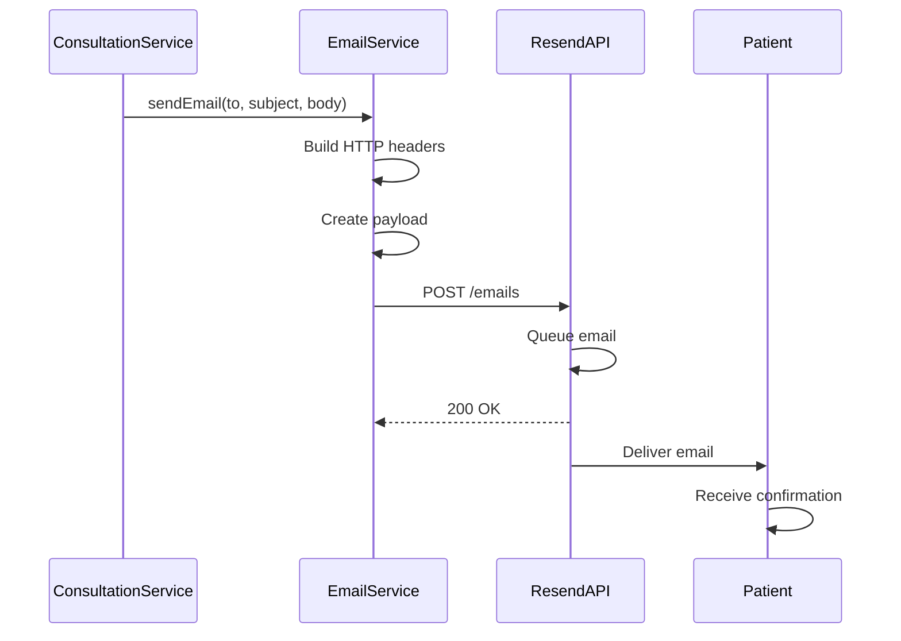

## Overview

Med Agenda uses the Resend email service to send automated notifications for appointment confirmations, reminders, and other system events. The email system is integrated throughout the application lifecycle to keep patients and doctors informed.

## Email Service Architecture

The email service uses Resend's REST API with Spring's RestTemplate:

```java EmailService.java:13-39
@Service
public class EmailService {

    @Value("re_6gEiCUYB_D8rKKD2XZPJRhUXQCh6gQwpX")
    private String apiKey;

    @Value("onboarding@resend.dev")
    private String fromEmail;

    private final RestTemplate restTemplate = new RestTemplate();
    private final String RESEND_API_URL = "https://api.resend.com/emails";

    public void sendEmail(String to, String subject, String body) {
        HttpHeaders headers = new HttpHeaders();
        headers.setContentType(MediaType.APPLICATION_JSON);
        headers.setBearerAuth(apiKey);

        Map<String, Object> payload = new HashMap<>();
        payload.put("from", fromEmail);
        payload.put("to", to);
        payload.put("subject", subject);
        payload.put("html", "<strong>" + body + "</strong>");

        HttpEntity<Map<String, Object>> request = new HttpEntity<>(payload, headers);
        restTemplate.postForEntity(RESEND_API_URL, request, String.class);
    }
}
```

**Configuration:**
- **API Key**: Stored in application properties (`@Value` annotation)
- **From Address**: Default sender email (onboarding@resend.dev)
- **API URL**: `https://api.resend.com/emails`
- **Authentication**: Bearer token authentication

## When Notifications Are Sent

### 1. Appointment Confirmation

When a new consultation is created, an automatic confirmation email is sent:

```java ConsultationService.java:68-73
// Send email confirmation
emailService.sendEmail(
        "delivered@resend.dev",
        "Consulta confirmada",
        "Sua consulta foi marcada para " + consultation.getDateTime()
);
```

**Trigger:** `POST /consultations/create`

**Email Details:**
- **To:** Patient's email (currently hardcoded to delivered@resend.dev for testing)
- **Subject:** "Consulta confirmada"
- **Body:** Appointment date and time

### 2. Appointment Reminders

While not currently implemented in the codebase, the system architecture supports scheduled reminders:

```java
// Example implementation (not in current codebase)
public void sendAppointmentReminder(Consultation consultation) {
    String patientEmail = consultation.getPatient().getEmail();
    String message = String.format(
        "Lembrete: Você tem uma consulta agendada para %s com Dr(a). %s",
        consultation.getDateTime(),
        consultation.getDoctor().getName()
    );
    
    emailService.sendEmail(
        patientEmail,
        "Lembrete de Consulta",
        message
    );
}
```

## Email Integration Flow



## Email Payload Structure

The system sends emails using Resend's API format:

```json
{
  "from": "onboarding@resend.dev",
  "to": "patient@example.com",
  "subject": "Consulta confirmada",
  "html": "<strong>Sua consulta foi marcada para 2024-03-15T10:00:00</strong>"
}
```

**Supported Fields:**
- `from`: Sender email address
- `to`: Recipient email address (or array for multiple recipients)
- `subject`: Email subject line
- `html`: HTML-formatted email body

## HTML Email Formatting

Currently, emails use simple HTML formatting:

```java EmailService.java:34
payload.put("html", "<strong>" + body + "</strong>");
```

For richer email templates, you can expand this:

```java
String htmlBody = String.format("""
    <!DOCTYPE html>
    <html>
    <head>
        <style>
            .header { background-color: #4CAF50; color: white; padding: 10px; }
            .content { padding: 20px; }
            .footer { font-size: 12px; color: #888; }
        </style>
    </head>
    <body>
        <div class="header">
            <h1>Med Agenda</h1>
        </div>
        <div class="content">
            <p>%s</p>
        </div>
        <div class="footer">
            <p>Este é um email automático. Por favor, não responda.</p>
        </div>
    </body>
    </html>
    """, body);
```

## Configuration and Security

The email service uses Spring Boot's `@Value` annotation for configuration:

```java
@Value("re_6gEiCUYB_D8rKKD2XZPJRhUXQCh6gQwpX")
private String apiKey;

@Value("onboarding@resend.dev")
private String fromEmail;
```

**Best Practice:** Store these in `application.properties` or environment variables:

```properties
# application.properties
email.resend.apiKey=${RESEND_API_KEY}
email.resend.fromAddress=${FROM_EMAIL:onboarding@resend.dev}
```

Then update the service:

```java
@Value("${email.resend.apiKey}")
private String apiKey;

@Value("${email.resend.fromAddress}")
private String fromEmail;
```

## Error Handling

The current implementation doesn't include explicit error handling. Enhanced version:

```java
public boolean sendEmail(String to, String subject, String body) {
    try {
        HttpHeaders headers = new HttpHeaders();
        headers.setContentType(MediaType.APPLICATION_JSON);
        headers.setBearerAuth(apiKey);

        Map<String, Object> payload = new HashMap<>();
        payload.put("from", fromEmail);
        payload.put("to", to);
        payload.put("subject", subject);
        payload.put("html", "<strong>" + body + "</strong>");

        HttpEntity<Map<String, Object>> request = new HttpEntity<>(payload, headers);
        ResponseEntity<String> response = restTemplate.postForEntity(
            RESEND_API_URL, request, String.class);
        
        return response.getStatusCode().is2xxSuccessful();
    } catch (Exception e) {
        // Log error
        System.err.println("Failed to send email: " + e.getMessage());
        return false;
    }
}
```

## Notification Types

### Current Notifications

| Event | Trigger | Recipient | Template |
|-------|---------|-----------|----------|
| Appointment Created | POST /consultations/create | Patient | "Consulta confirmada" |

### Potential Future Notifications

| Event | Trigger | Recipient | Template |
|-------|---------|-----------|----------|
| Appointment Updated | PUT /consultations/update | Patient & Doctor | "Consulta reagendada" |
| Appointment Canceled | DELETE /consultations/{id} | Patient & Doctor | "Consulta cancelada" |
| 24h Reminder | Scheduled task | Patient | "Lembrete: Consulta amanhã" |
| 1h Reminder | Scheduled task | Patient | "Sua consulta é em 1 hora" |
| Diagnosis Created | POST /diagnosis | Patient | "Novo diagnóstico disponível" |
| Payment Confirmed | Payment status change | Patient | "Pagamento confirmado" |

## Integration with Consultation Lifecycle

Emails are sent during consultation creation:

```java ConsultationService.java:42-76
public Consultation createConsultation(Patient patient, Doctor doctor, 
                                       LocalDateTime dateTime, boolean isUrgent, 
                                       String observation) {
    // 1. Validate patient and doctor
    Patient patientFromDb = patientRepository.findByCpf(patient.getCpf())
            .orElseThrow(...);
    Doctor doctorFromDb = doctorRepository.findByCrm(doctor.getCrm())
            .orElseThrow(...);

    // 2. Create consultation
    Consultation consultation = new Consultation();
    consultation.setDateTime(dateTime);
    consultation.setPatient(patientFromDb);
    consultation.setDoctor(doctorFromDb);
    consultation = consultationRepository.save(consultation);

    // 3. Create payment
    Payment payment = new Payment();
    payment.setConsultation(consultation);
    paymentRepository.save(payment);

    // 4. Send confirmation email
    emailService.sendEmail(
            "delivered@resend.dev",
            "Consulta confirmada",
            "Sua consulta foi marcada para " + consultation.getDateTime()
    );

    return consultation;
}
```

## Resend API Features

Resend provides additional features that can be integrated:

1. **Email Tracking**: Track opens, clicks, and bounces
2. **Templates**: Use pre-built email templates
3. **Attachments**: Include PDFs or other documents
4. **Batch Sending**: Send multiple emails efficiently
5. **Scheduling**: Schedule emails for future delivery
6. **Domain Verification**: Use custom domain for professional emails

## Testing Email Notifications

During development, use Resend's test mode:

```java
// Test recipient
String testEmail = "delivered@resend.dev"; // Always delivers successfully

// Send test email
emailService.sendEmail(
    testEmail,
    "Test Notification",
    "This is a test email from Med Agenda"
);
```

## Best Practices

1. **Use environment variables** for API keys and sensitive data
2. **Implement retry logic** for failed email sends
3. **Log email events** for debugging and auditing
4. **Validate email addresses** before sending
5. **Use HTML templates** for professional-looking emails
6. **Include unsubscribe options** for transactional emails
7. **Rate limit email sending** to avoid API throttling
8. **Send to actual patient emails** instead of hardcoded addresses in production

## Performance Considerations

- Email sending is **synchronous** - consider async processing for better performance
- Use **Spring's @Async** annotation for non-blocking email sends:

```java
@Async
public CompletableFuture<Boolean> sendEmailAsync(String to, String subject, String body) {
    boolean success = sendEmail(to, subject, body);
    return CompletableFuture.completedFuture(success);
}
```

## Monitoring and Analytics

Integrate email tracking:

```java
// Track email events
public void trackEmailEvent(String emailId, String event) {
    // Log to database or analytics service
    logger.info("Email {} - Event: {}", emailId, event);
}
```

Possible events:
- `sent`: Email sent to Resend
- `delivered`: Email delivered to recipient
- `opened`: Recipient opened email
- `clicked`: Recipient clicked link
- `bounced`: Email bounced
- `complained`: Marked as spam
