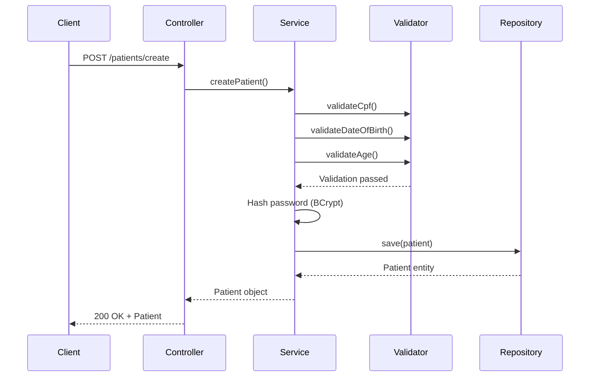

## Overview

Med Agenda's patient management system handles patient registration, authentication, profile updates, and medical history tracking. The system uses CPF (Brazilian tax ID) as the primary identifier and implements secure password hashing with BCrypt.

## Patient Data Model

The patient entity stores comprehensive information about each patient:

```java Patient.java:8-49
@Entity
@Table(name = "patienty")
public class Patient {

    @Id
    @Column(name = "cpf", length = 11, nullable = false, unique = true)
    private String cpf;

    @Column(nullable = false, unique = true)
    private String email;

    @Column(nullable = false)
    private String password;

    @Column(name = "name", nullable = false)
    private String name;

    @Column(name = "date_of_birth", nullable = false)
    private LocalDate dateOfBirth;

    @Column(name = "address", length = 255)
    private String address;

    @Column(name = "medical_history")
    private String medicalHistory;

    @OneToMany(mappedBy = "patient", cascade = CascadeType.ALL, fetch = FetchType.LAZY)
    @JsonIgnore
    private List<Consultation> historicoConsultas;

    public Patient(String cpf, String email, String password, String name, 
                   LocalDate dateOfBirth, String address, String medicalHistory) {
        this.cpf = cpf;
        this.email = email;
        this.password = password;
        this.name = name;
        this.dateOfBirth = dateOfBirth;
        this.address = address;
        this.medicalHistory = medicalHistory;
    }
}
```

**Key Fields:**
- `cpf`: 11-digit Brazilian tax ID (primary key)
- `email`: Unique email for authentication
- `password`: BCrypt-hashed password
- `name`: Patient's full name
- `dateOfBirth`: Date of birth (validated to ensure 18+ age)
- `address`: Residential address
- `medicalHistory`: Medical background and conditions
- `historicoConsultas`: One-to-many relationship with consultations

## Patient Registration

New patient registration includes automatic password hashing for security.

```java PatientService.java:29-33
public Patient createPatient(String cpf, String name, LocalDate dateOfBirth, 
                            String address, String medicalHistory, 
                            String email, String rawPassword) {
    String hashedPassword = passwordEncoder.encode(rawPassword);
    Patient patient = new Patient(cpf, email, hashedPassword, name, 
                                 dateOfBirth, address, medicalHistory);
    return patientRepository.save(patient);
}
```

### API Endpoint

```java PatientController.java:33-45
@PostMapping("/create")
public ResponseEntity<Patient> createPatient(@RequestBody Patient patient) {
    Patient newPatient = patientService.createPatient(
            patient.getCpf(),
            patient.getName(),
            patient.getDateOfBirth(),
            patient.getAddress(),
            patient.getMedicalHistory(),
            patient.getEmail(),
            patient.getPassword()
    );
    return ResponseEntity.ok(newPatient);
}
```

**Endpoint:** `POST /patients/create`

**Request Body:**
```json
{
  "cpf": "12345678901",
  "email": "patient@example.com",
  "password": "securePassword123",
  "name": "João Silva",
  "dateOfBirth": "1990-05-15",
  "address": "Rua das Flores, 123",
  "medicalHistory": "Diabetic, allergic to penicillin"
}
```

## Patient Authentication

The system uses email and password for authentication with BCrypt verification.

```java PatientService.java:35-41
public Optional<Patient> authenticatePatient(String email, String rawPassword) {
    Optional<Patient> patient = patientRepository.findByEmail(email);
    if (patient.isPresent() && 
        passwordEncoder.matches(rawPassword, patient.get().getPassword())) {
        return patient;
    }
    return Optional.empty();
}
```

### Login Endpoint

```java PatientController.java:24-31
@PostMapping("/login")
public ResponseEntity<String> login(@RequestBody Patient loginRequest) {
    Optional<Patient> patient = patientService.authenticatePatient(
        loginRequest.getEmail(), loginRequest.getPassword());
    if (patient.isPresent()) {
        return ResponseEntity.ok("Login successful!");
    }
    return ResponseEntity.status(401).body("Invalid email or password.");
}
```

**Endpoint:** `POST /patients/login`

## Patient Validation

Med Agenda enforces strict validation rules for patient data:

```java PatientValidator.java:6-29
public class PatientValidator {

    public static void validateAge(LocalDate dateOfBirth) {
        if (calculateAge(dateOfBirth) < 18) {
            throw new IllegalArgumentException(
                "O paciente deve ter pelo menos 18 anos");
        }
    }

    private static int calculateAge(LocalDate dateOfBirth) {
        return Period.between(dateOfBirth, LocalDate.now()).getYears();
    }

    public static void validateCpf(String cpf) {
        if (cpf == null || cpf.length() != 11) {
            throw new IllegalArgumentException(
                "O CPF precisa ter 11 dígitos");
        }
    }

    public static void validateDateOfBirth(LocalDate dateOfBirth) {
        if (dateOfBirth.isAfter(LocalDate.now())) {
            throw new IllegalArgumentException(
                "A Data de nascimento não pode ser do futuro");
        }
    }
}
```

**Validation Rules:**
- Patients must be at least 18 years old
- CPF must be exactly 11 digits
- Date of birth cannot be in the future

## Updating Patient Information

Patients can update their profile with validation enforcement.

```java PatientService.java:51-71
public Optional<Patient> updatePatient(String cpf, String name, 
                                       LocalDate dateOfBirth, String address, 
                                       String medicalHistory) {
    Optional<Patient> existingPatient = patientRepository.findByCpf(cpf);
    if (existingPatient.isPresent()) {
        // Validate before updating
        PatientValidator.validateCpf(cpf);
        PatientValidator.validateDateOfBirth(dateOfBirth);
        PatientValidator.validateAge(dateOfBirth);

        // Update patient fields
        Patient patient = existingPatient.get();
        patient.setCpf(cpf);
        patient.setName(name);
        patient.setDateOfBirth(dateOfBirth);
        patient.setAddress(address);
        patient.setMedicalHistory(medicalHistory);

        patientRepository.save(patient);
        return Optional.of(patient);
    }
    return Optional.empty();
}
```

**Endpoint:** `PUT /patients/update/{cpf}`

## Querying Patients

### Get Patient by CPF

```java PatientService.java:43-45
public Optional<Patient> getPatientByCpf(String cpf) {
    return patientRepository.findByCpf(cpf);
}
```

**Endpoint:** `GET /patients/{cpf}`

### Get All Patients

```java PatientService.java:47-49
public List<Patient> getAllPatients() {
    return patientRepository.findAll();
}
```

**Endpoint:** `GET /patients/list`

## Deleting Patients

```java PatientService.java:74-80
public boolean deletePatient(String cpf) {
    if (patientRepository.existsById(cpf)) {
        patientRepository.deleteById(cpf);
        return true;
    }
    return false;
}
```

**Endpoint:** `DELETE /patients/delete/{cpf}`

## Patient Medical History Tracking

Patients have a one-to-many relationship with consultations, enabling complete history tracking:

```java Patient.java:34-36
@OneToMany(mappedBy = "patient", cascade = CascadeType.ALL, fetch = FetchType.LAZY)
@JsonIgnore
private List<Consultation> historicoConsultas;
```

This relationship allows:
- Viewing all past consultations for a patient
- Tracking diagnoses across multiple visits
- Analyzing treatment patterns over time

## Search and Filtering

The repository supports multiple search strategies:

```java
// Find by CPF (primary identifier)
patientRepository.findByCpf(cpf)

// Find by email (for authentication)
patientRepository.findByEmail(email)

// Get all patients
patientRepository.findAll()
```

## Patient Registration Flow



## Security Considerations

1. **Password Hashing**: All passwords are hashed using BCrypt before storage
2. **Unique Constraints**: Both CPF and email must be unique
3. **Validation**: Strict validation on CPF format and age requirements
4. **Lazy Loading**: Consultation history is lazily loaded to improve performance
5. **JSON Ignore**: Password field should be ignored in API responses (security best practice)

## Data Storage

**Patient Information Stored:**
- Personal identification (CPF, name)
- Contact information (email, address)
- Date of birth and calculated age
- Complete medical history
- Encrypted password for authentication
- Linked consultation records

## Best Practices

- Always validate patient data before saving
- Never return password hashes in API responses
- Use CPF as the primary identifier for consistency
- Validate age requirement (18+) during registration and updates
- Store medical history as text for flexibility
- Implement cascade deletion carefully to preserve medical records
